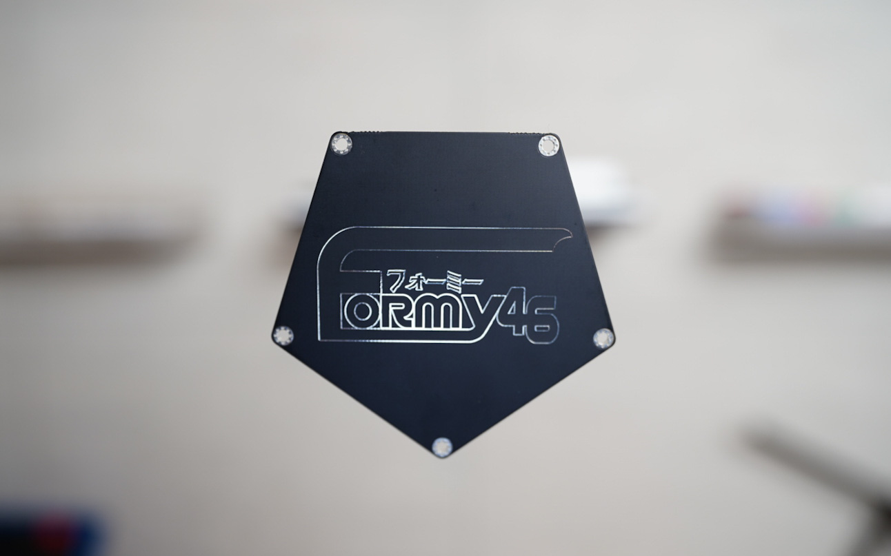
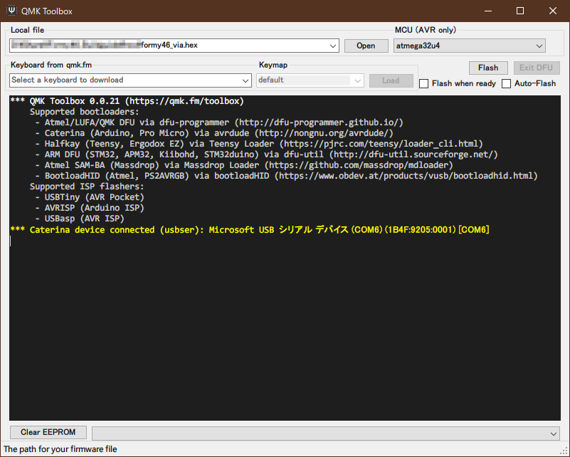
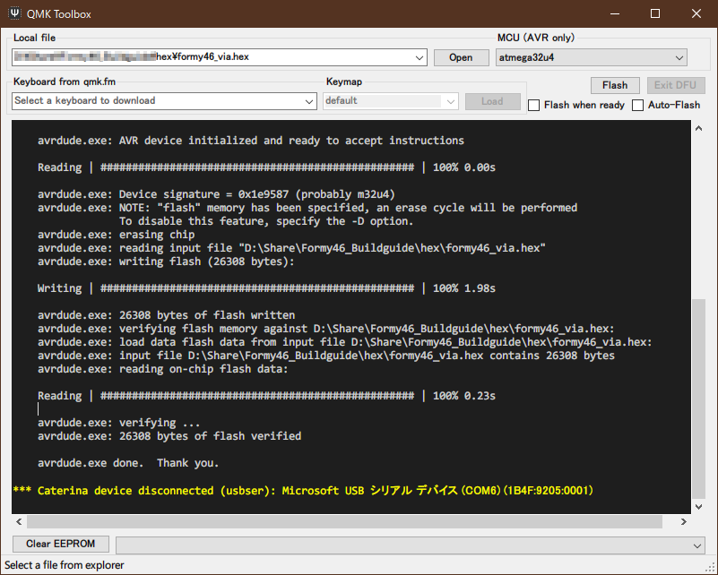
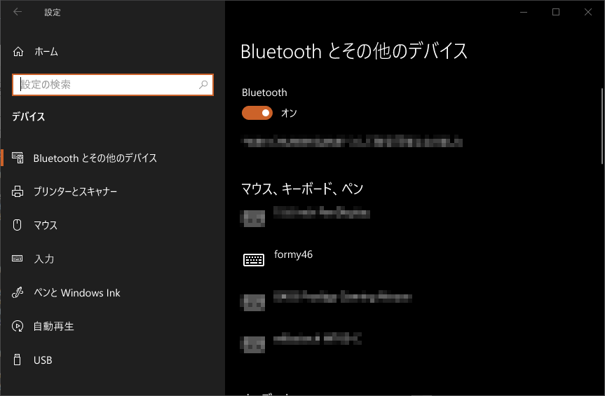
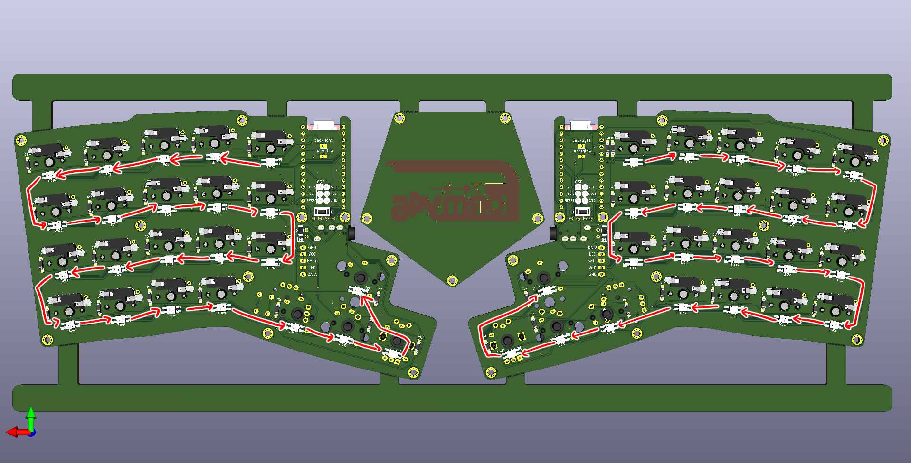

# Alico48 ビルドガイド
  
### 目次
- [Alico48 ビルドガイド](#alico48-ビルドガイド)
    - [目次](#目次)
    - [はじめに](#はじめに)
    - [全体の流れ](#全体の流れ)
    - [ファームウェアについて注意](#ファームウェアについて注意)
  - [01. 内容品及び追加購入品が数通りあることを確認する](#01-内容品及び追加購入品が数通りあることを確認する)
    - [内容品](#内容品)
    - [追加購入品](#追加購入品)
  - [02. レイアウトを決定する](#02-レイアウトを決定する)
  - [03. PCBに部品を実装する](#03-pcbに部品を実装する)
    - [03.01. 半田ごてをコンセントに刺す](#0301-半田ごてをコンセントに刺す)
    - [03.02. ProMicroとコンスルーをはんだ付けする](#0302-promicroとコンスルーをはんだ付けする)
    - [03.03. 親指部分のパーツをはんだ付けする](#0303-親指部分のパーツをはんだ付けする)
    - [03.04. SK6812MINI-Eをはんだ付けする(オプション)](#0304-sk6812mini-eをはんだ付けするオプション)
    - [03.05. OLEDをはんだ付けする（オプション）](#0305-oledをはんだ付けするオプション)
    - [03.06. はんだごてのコンセントを抜く](#0306-はんだごてのコンセントを抜く)
  - [04. ProMicroにファームウェアを書き込み、PCBの動作チェックを行う](#04-promicroにファームウェアを書き込みpcbの動作チェックを行う)
    - [04.01. ProMicroにファームウェアを書き込む](#0401-promicroにファームウェアを書き込む)
    - [04.02. ProMicroとTRRSケーブルをPCBに接続し、動作確認する](#0402-promicroとtrrsケーブルをpcbに接続し動作確認する)
  - [05. プレート類を順番に組み立てる](#05-プレート類を順番に組み立てる)
    - [05.01. ボトムプレートにスペーサーを取り付ける](#0501-ボトムプレートにスペーサーを取り付ける)
    - [05.02. OLED保護プレートを固定する](#0502-oled保護プレートを固定する)
    - [05.03. トッププレートをスペーサープレートと共に取り付ける](#0503-トッププレートをスペーサープレートと共に取り付ける)
    - [05.04. 底面にゴム足を貼る](#0504-底面にゴム足を貼る)
  - [06. スイッチを差し込みキーキャップを付ける](#06-スイッチを差し込みキーキャップを付ける)
  - [07. 完成！](#07-完成)

### はじめに
このページはFormy46の組み立て手順を解説するページです。  
事前に全体を読んだ上で作業を開始してください。  
また、[工具セット](https://shop.yushakobo.jp/collections/accessory/products/a9900to)と同程度の工具を所有していることを前提として解説を進めます。 

### 全体の流れ
初心者の方であれば、3～4時間ほどの作業時間を確保した上で作業することをおすすめします。  
01. 内容品及び追加購入品が数通りあることを確認する  
02. レイアウトを決定する
03. PCBに部品を実装する  
04. ProMicroにファームウェアを書き込み、PCBの動作チェックを行う  
05. プレート類を順番に組み立てる  
06. スイッチを差し込みキーキャップを付ける  
07. 完成！  

### ファームウェアについて注意
ファームウェアについて、QMK Firmwareに本キーボードのファームウェアを今後追加予定です。  
しかし、様々な手続きが必要なため、しばらくはQMK Toolboxを使用してファームウェアを書き込みます。  
リンクはこちらから→[デフォルト](hex/formy46_default.hex)/[VIA](formy46_via.hex)
また、ファームウェアのカスタマイズができる方は[こちら](https://github.com/marby3/qmk_firmware/tree/marby_local)を利用してファームウェアを書き込んでください。
今後の対応予定については以下の通りです。  
- QMK Firmware  
    公式のリポジトリへ追加予定 
    ※PR済みなので、しばらくしたら追加されます
- VIA  
    QMK Firmwareがマージされた後に追加予定  
    ※PR済みなので、しばらくしたら追加されます
- Remap  
    QMK Firmwareがマージされた後に追加予定  
- BLE Micro Pro  
    導入方法を調査後、対応予定  
- ZMK等、他のファームウェア  
    上記の作業が終わった後に追加検討をする予定  

## 01. 内容品及び追加購入品が数通りあることを確認する
### 内容品
[Formy46](https://shop.yushakobo.jp/products/XXX)に同梱されています。  
| NO | 部品名 | 数量 | 備考 |
| --- | --- | --- | --- |
| 1 | PCB(left) | 1 | PCBA済み v1.0 |
| 2 | PCB(right) | 1 | PCBA済み v1.0 |
| 3 | トッププレート(left) | 1 |  |
| 4 | トッププレート(right) | 1 |  |
| 5 | 親指アドオンプレート(left) | 1 |  |
| 6 | 親指アドオンプレート(right) | 1 |  |
| 7 | 親指共通プレート | 1 |  |
| 8 | スペーサープレート(left) | 3 | 上・中・下セット |
| 9 | スペーサープレート(right) | 3 | 上・中・下セット |
| 10 | ボトムプレート(left) | 1 |  |
| 11 | ボトムプレート(right) | 1 |  |
| 12 | OLED保護プレート | x2 | 表裏アリ |
| 13 | バインド小ねじ（金メッキ） M2 5mm | x7 |  |
| 14 | バインド小ねじ（金メッキ） M2 8mm | x13 |  |
| 14 | スリムヘッド小ねじ（黒） M2 4mm | x20 |  |
| 15 | M2スペーサー 3mm | x19 |  |
| 16 | M2スペーサー 8mm | x4 | OLEDカバーアクリル固定用 |
| 17 | ジョイスティック | x1 | Kailh製 |
| 18 | ジョイスティックキャップ | x1 | 金属製 |
| 19 | 丸ゴム足 | x8 |  |
| 20 | 同梱シート | x1 |  |

  
※不足品があった場合は下記の連絡先へご連絡をお願いします。  
Twitter:[@marbySAN](https://twitter.com/marbySAN)
Discord:[長屋Craftworks](https://discord.gg/r4ck4aTZvC)

### 追加購入品
追加で購入する必要がある部品です。  
レイアウトにより購入する必要のある数が変動します。
| NO | 部品名 | 数量 | 備考 |
| --- | --- | --- | --- |
| 20 | ProMicro | 2 | ProMicro互換品を使用可能 |
| 21 | コンスルー 12ピン(2.5mm) | 2 |  |
| 22 | OLEDモジュール | 2 | OLEDが不要な場合実装不要 |
| 23 | SK6812MINI-E | 46 | 光らせない場合実装不要 |
| 24 | Cherry MXスイッチ | 適量 | 38～40個 |
| 24 | Kailh Chocスイッチ | 適量 | 0～8個 |
| 25 | CherryMXキーキャップ（1U） | 適量 | 38個 |
| 25 | CherryMXキーキャップ（2U） | 適量 | 0～2個、ISOエンターも使用可能 |
| 25 | Kailh Chocキーキャップ（1U） | 適量 | 0～8個 |
| 25 | スタビライザー（2U） | 適量 | 0～2個 |
| 22 | TRRSケーブル | 1 | TRSケーブルも使用可能 |
| 27 | USBケーブル | 1 | ProMicroに対応したケーブル |

  

## 02. レイアウトを決定する
Formy46は親指部分のレイアウトを選択してカスタマイズすることができます。  
基本的には以下の2種類があります。  
  
ジョイスティック x1・Cherry MXスイッチ+スタビライザー（2U） x1・ロータリーエンコーダー x1  
  
Kailh Choc x4 or Choc x3・ロータリーエンコーダー x1  

キットに同梱されているトッププレートでは、レイアウト1とレイアウト2を左右で組み合わせてキーボードにすることを想定しています。  
また、トッププレートは遊舎工房などのアクリルでカットして色を変更することもできます。（予定）  
※キーボードアクリルプレートに登録する予定です。  

## 03. PCBに部品を実装する
### 03.01. 半田ごてをコンセントに刺す
半田ごては大変高温になり危険な道具ですので、使用の際には細心の注意を持って使用するようにしてください。  
03.の章は全て読んでから作業をすると安心です。

### 03.02. ProMicroとコンスルーをはんだ付けする
ProMicroをコンスルー 12ピン(2.5mm)にはんだ付けします。  

コンスルー 12ピン(2.5mm)を挿入し、はんだ付けします。  
コンスルーには向きがあるので、画像を参考にコンスルーを取り付けてください。
  
はんだ付けを上手にするには、コンスルー 12ピン(2.5mm)をPCBに差し込み上面から1箇所ずつ調整しながらはんだ付けすると綺麗にできます。  
今後はこのはんだ付けしたものをProMicroと呼びます。  
  
(※Elite-C等はコンスルーを差し込むだけで導通するのではんだ付け不要です。)  
(※BLE Micro Proを使用する際、13ピンが必要になります。)  

### 03.03. 親指部分のパーツをはんだ付けする
親指部分のパーツを2.で決定したレイアウト通りにはんだ付けします。  

layout1では、ジョイスティック/Cherry MXスイッチ/ロータリーエンコーダー/親指アドオンプレート（左右に応じて）/
バインド小ねじ（金メッキ） M2 8mm/M2スペーサー 3mm/スタビライザー（2U）を使用します。  
組み立てのために親指アドオンプレートにバインド小ねじ（金メッキ）とM2スペーサー 3mmを使用し、プレートに固定します。  
  
その後、PCBにスタビライザーを固定し、パーツをはんだ付けします。  
  

layout2では、Kailh Chocスイッチ/ロータリーエンコーダー/親指共通プレートを使用します。
親指共通プレートにKailh Chocスイッチをはめ込みます。その後基板に差し込み、プレートをスイッチとPCBで挟み込みます。
  
その後、パーツをはんだ付けします。  
  

### 03.04. SK6812MINI-Eをはんだ付けする(オプション)
SK6812MINI-EをPCB(left)とPCB(right)にはんだ付けします。  

YS-SK6812MINI-EをPCB裏面の四角い穴にはめ込み、ピンを4つはんだ付けしていきます。  
YS-SK6812MINI-EをPCBの目印に合わせてはめ込みます。  
  
最初に4つのうち1つをはんだ付けし、YS-SK6812MINI-Eを固定します。  
全てのYS-SK6812MINI-Eを固定できたら、残りのYS-SK6812MINI-Eのピンをはんだ付けします。  
  
また、基板の「backlight」ジャンパーにハンダを盛って導通させます。
  

### 03.05. OLEDをはんだ付けする（オプション）
OLEDモジュールをPCB(left)とPCB(right)にはんだ付けします。  

OLEDモジュールに付属しているピンのうち、両方ともトゲトゲしている方がOLED側に、片方穴になっている方がPCB側にはんだ付けされます。

### 03.06. はんだごてのコンセントを抜く
事故を避けるために、一度はんだごてのコンセントを抜きます。  
04.02.ではんだ不良が見つかった場合、再度コンセントを刺し作業を進めるようにしてください。  

## 04. ProMicroにファームウェアを書き込み、PCBの動作チェックを行う
### 04.01. ProMicroにファームウェアを書き込む
ProMicroにファームウェアを書き込みます。  
Formy46のHexファイルをダウンロードします。  
- [Default](hex/formy46_default.hex)
- [VIA](formy46_via.hex)
次に、[QMK Toolbox](https://github.com/qmk/qmk_toolbox)をDLし、実行します。  
Formy46のHexファイルをQMK Toolboxで読み込み、Flashします。  
  
正常に書き込みが進んだ場合、最後にProMicroのリセットピンとGNDピンを短絡させ、リセットする必要があります。  
PCBに差し込みタクタイルスイッチを1～2秒長押しした後離すと、書き込みが完了します。  
  
ファームウェアの書き込みが正常に終わった場合、ProMicroが「Formy46」として認識されます。  
  

### 04.02. ProMicroとTRRSケーブルをPCBに接続し、動作確認する
PCBにProMicroとUSBケーブル、TRRSケーブルを繋ぎ、動作確認を行います。  

PCBにProMicroを差し込み、USBケーブルでPCと接続します。また、左右間をTRRSケーブルで接続します。  
[QMK Configuratorキーボード入力テスト](https://config.qmk.fm/#/test)を開き、スイッチをソケットに差し込みます。  
はんだ付けに成功している場合、全てのキーにて入力が行われます。  
  
もし入力が行われない場合、はんだ付けを忘れている可能性があるので、入力されていないキーのソケットとダイオードを確認してみてください。  
また、LEDについては光らないキーのピンが綺麗にはんだ付けされているかを確認してください。  
もしLEDが光らない場合は、光っていないLEDのピンか、その左右のLEDのピンのはんだ付けが甘い可能性があります。  
赤い矢印の順でLEDが繋がっているので、光らないLEDの前後を確認してみてください。
  

全て正常に動作していることが確認できたら、USBケーブル、TRRSケーブルを全て取り外します。  

## 05. プレート類を順番に組み立てる
プレート類の保護シートを剥がしておきます。

### 05.01. ボトムプレートにスペーサーを取り付ける
M2スペーサー 3mmを、スリムヘッド小ねじ（黒） M2 4mmでボトムプレートに取り付けます。  
  
layout1を選択した方のPCBについては、PCB側からバインド小ねじ（金メッキ） 8mmの先端が見えるので、M2スペーサー 3mmをそちらに固定してしまってから、スリムヘッド小ねじ（黒） M2 4mmで固定します。  
  
取り付ける際に、ねじをなめないように、あまり強く回しすぎないようにしてください。  
使用するドライバーはプラス1番がおすすめです。  

### 05.02. OLED保護プレートを固定する
OLED保護プレートをバインド小ねじ（金メッキ） M2 5mmとスリムヘッド小ねじ（黒） M2 4mmを使用して、PCBに固定します。  
OLED保護プレートには表と裏があり、表面がスモーク上になっている方をOLED側になるように取り付けます。  
  

### 05.03. トッププレートをスペーサープレートと共に取り付ける
トッププレート、スペーサープレート、PCB、ボトムプレートを整列させ、バインド小ねじ（金メッキ） 8mmで固定します。  
固定する際、スペーサープレートの位置がズレやすいので注意が必要です。  
  
スペーサープレートの位置は以下に置いてください。
  

### 05.04. 底面にゴム足を貼る
キーボード本体の裏面に丸ゴム足と長丸ゴム足を貼ります。

下記の画像の箇所に丸ゴム足を貼ります。
  

## 06. スイッチを差し込みキーキャップを付ける
スイッチを差し込みキーキャップを取り付けます。
  

## 07. 完成！
お疲れ様でした！
  